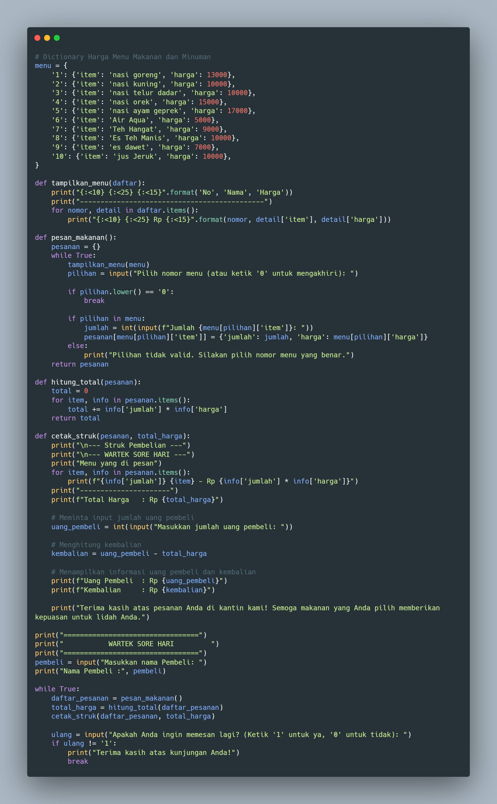
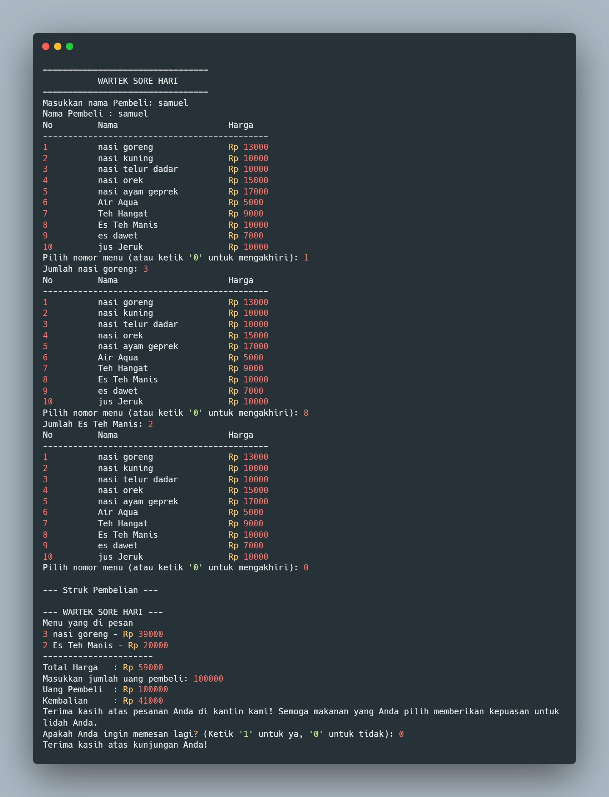

# project uas

## profil
| Variabel | Isi |
| ---------- | --- |
| **Nim** | 312310462 |
| **Nama** | SAMUEL DAMATTA TINDAON |
| **Kelas** | TI.23.A5 |
| **Dosen** | Agung Nugroho,S.Kom,M.Kom |
| **Mata Kuliah** | Bahasa Pemrograman |
| **Link YOUTUBE** | https://youtu.be/XAqktqI9hZ0?si=O4zGr388jmqSKqyP |

### Project UAS Bahasa Pemrograman

*Buatlah program kasir di sebuah wartek, dengan kondisi berikut:*
- list opsi pilihan makanan/minuman dan aksi, bisa mengunakan
-format dictionary
-program harus meminta input pilihan makanan dari pengguna.
-program harus menghitung total harga makanan yang di pesan.
-program harus menampilkan struk pembelian

## Kode program Kasir

## output program

## Masukan Menu

## Mencetak Struk

